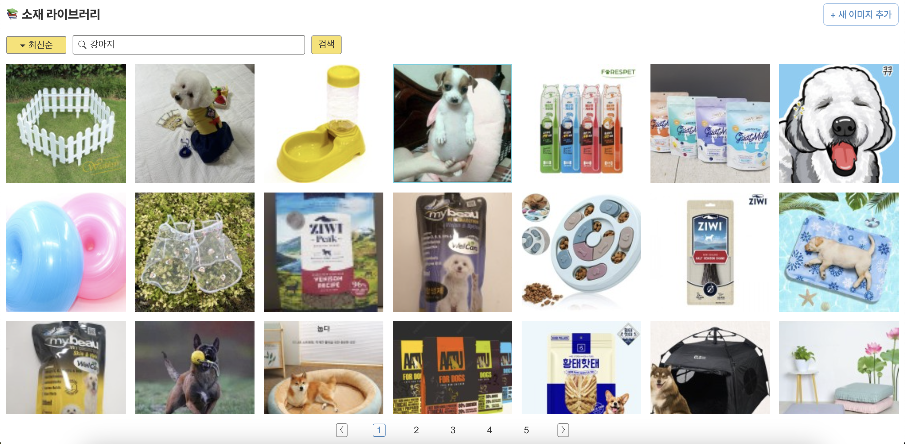

# 📂 외부 API(NAVER API)를 사용한 이미지 검색

 

## 1. 실행 방법

- .env 파일 생성
- [naver developer](https://developers.naver.com/apps/#/list)에서 클라이언트 id와 pw를 발급받습니다.
- 비로그인 오픈 API 환경에서 실행시킬 URL을 추가합니다.
- 개발 환경에서 테스트할 경우 'http:localhost'를 추가합니다.
- '.env' 파일을 생성한다.
- 'REACT_APP_NAVER_CLIENT_ID=클라이언트 id','REACT_APP_NAVER_CLIENT_SECRET=클라이언트 pw'를 추가합니다.
- npm install
- npm run start

 

## 2. 개발 기술

### React, Typescript

- React
  - 컴포넌트화를 통해 추후 유지보수와 재사용성을 고려했습니다.

### eslint, prettier

- 정해진 규칙에 따라 자동적으로 코드 스타일을 정리해 코드의 일관성을 유지하고자 했습니다.
- 코드 품질 관리는 eslint에, 코드 포맷팅은 prettier에 일임해 사용했습니다.
- airbnb의 코딩 컨벤션을 참고해 사용했습니다.

 

## 3. 구현 기능

- 타이틀 영역, 검색 영역, 그리드 영역, 페이지네이션 영역으로 구성되어 있습니다.
- 외부 api [naver api](https://developers.naver.com/docs/serviceapi/search/image/image.md) 문서에 따라 데이터롤 요청합니다.

### ✅ 타이틀 영역

- 타이틀 영역은 화면 상단에 고정되어있습니다.
- 왼쪽에는 화면 타이틀, 오른쪽에는 '새 이미지 추가' 버튼이 있습니다.
- '새 이미지 추가' 버튼을 누르면 모달창이 열립니다.
- 모달창 컨텐츠는 아직 미구현

### ✅ 검색 영역

- 검색 영역 초기 기본 검색어는 '티셔츠'로 고정되어 있습니다.
- 반응형 브라우저 사이즈에 따라 화면에 보여지는 아이템 갯수가 달라집니다.
- 정렬 방식은 '최신 순', '오래된 순'으로 정렬되며 정렬 방식을 바꾸면 페이지네이션은 다시 1페이지로 돌아갑니다.
- 네이버 이미지 API를 활용합니다.
- 현재 화면에 보여질 아이템 갯수를 (검색어)query, (한 번에 표시할 검색 결과 개수) display를 기준으로 계산합니다.
- 브라우저 너비가 1200미만일 때, display = 12
- 브라우저 너비가 1200이상 1440미만, display = 20
- 브라우저 너비가 1440이상 1900미만, display = 28
- 브라우저 너비가 1900이상, display = 40

### ✅ 그리드 영역

- 이미지를 그리드 정사각형 안에 비율을 유지해 노출시킵니다.
- 데이터 로딩중일 때는 화면 중앙에 로딩 화면을 노출시킵니다.
- 데이터가 비어있을 때는, 데이터가 없음을 나타냅니다.
- 검색 영역과 페이지네이션 영역 중간에 위치하고, 내부 스크롤을 가지고 있습니다.
- 마우스를 올리면 border색이 변경됩니다.

### ✅ 페이지네이션 영역

- 화면 하단에 고정되어있습니다.
- 로딩중일 경우, 결과 데이터가 없을 경우에는 노출되지 않습니다.
- 페이지 이동시 새로운 데이터가 fetching 됩니다.
- 브라우저 너비에 따라 한 화면에 보이는 아이템 갯수가 달라지는 경우, 변경되는 아이템 수에 맞게 페이지 수 계산이 다시 이루어집니다.
