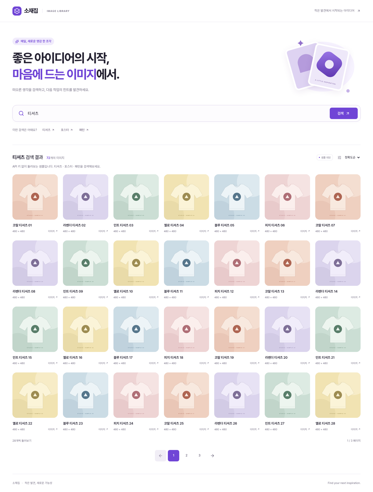
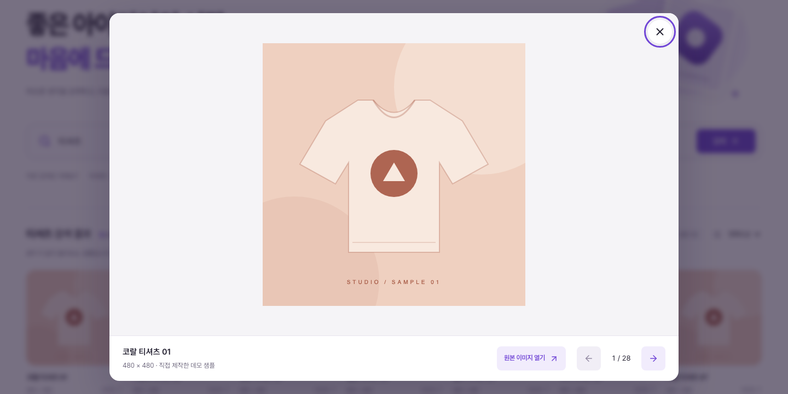
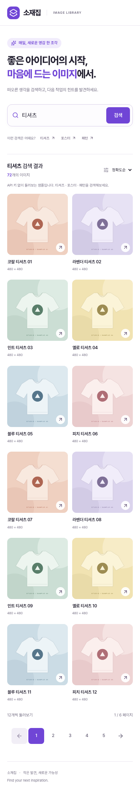
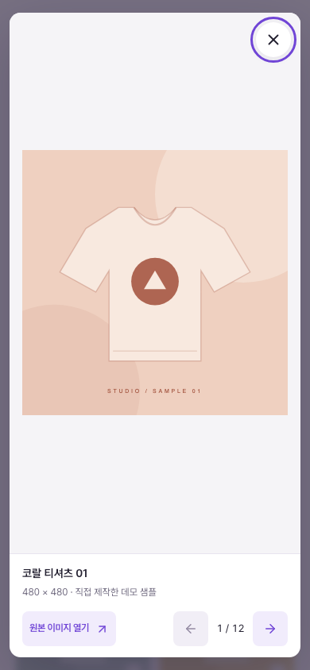

# 소재집

**Next.js와 네이버 검색 API로 만든 반응형 이미지 검색 사이트입니다.**

이미지 검색부터 정렬, 미리보기와 원본 확인까지 제공합니다. 검색 조건을 URL로 공유할 수 있고, 화면 크기가 달라져도 보던 위치를 이어서 탐색할 수 있습니다.

[사이트 바로가기](https://imageapi-test.vercel.app)

[주요 기능](#주요-기능) · [기술 스택](#기술-스택) · [실행 방법](#실행-방법)



화면은 샘플 데이터를 사용하는 데모 모드로 촬영했습니다.

## 주요 기능

| 기능           | 동작                                                                        |
| -------------- | --------------------------------------------------------------------------- |
| 이미지 검색    | 검색어 입력, 정확도순·최신순 정렬, 페이지 이동                              |
| 미리보기       | 이미지 확대, 원본 링크, 좌우 방향키 탐색, Escape 닫기                       |
| 검색 조건 공유 | 검색어·정렬·페이지를 URL에 저장하고 새로고침·뒤로가기 시 복원               |
| 반응형 목록    | 화면 너비에 따라 12·20·28·40개를 요청하고 현재 탐색 위치에 맞춰 페이지 보정 |
| 오류 복구      | 일시적인 오류 재시도, 기존 결과 유지, 호출 제한 시 대기 시간 안내           |

<details>
<summary>미리보기와 모바일 화면 보기</summary>

### 이미지 미리보기



### 모바일




</details>

## 기술 스택

| 구분                | 사용 기술                                                |
| ------------------- | -------------------------------------------------------- |
| 화면·서버           | Next.js App Router, React, TypeScript                    |
| 스타일·UI           | Tailwind CSS, Radix Dialog, Pretendard                   |
| 검색 데이터         | TanStack Query, Zod / Zod Mini                           |
| 공유 캐시·호출 제한 | Upstash Redis REST API — 연결 시 사용                    |
| 테스트·CI           | Vitest, Testing Library, Playwright, axe, GitHub Actions |

## 실행 방법

Node.js 24가 필요합니다.

```bash
npm ci
cp .env.example .env.local
npm run dev
```

`http://localhost:3000`에서 확인할 수 있습니다. 기본값은 샘플 이미지를 사용하는 데모 모드입니다.

실제 네이버 검색을 사용하려면 `.env.local`에 다음 값을 설정한 뒤 서버를 다시 실행합니다.

```dotenv
SEARCH_MODE=live
NAVER_CLIENT_ID=발급받은_ID
NAVER_CLIENT_SECRET=발급받은_SECRET
```

공유 캐시와 호출 제한을 사용하려면 `UPSTASH_REDIS_REST_URL`과 `UPSTASH_REDIS_REST_TOKEN`도 설정합니다. 기본 한도는 앱 전체 기준 분당 60회, 첫 요청부터 24시간 동안 2,000회입니다. Redis를 연결하지 않으면 공유 캐시와 호출 제한은 적용되지 않습니다. 설정 항목은 [`.env.example`](./.env.example)에 있습니다.

Vercel에서도 같은 환경 변수를 등록합니다. 인증 키에는 `NEXT_PUBLIC_` 접두사를 붙이지 않습니다.

## 테스트

```bash
npm run check
npx playwright install chromium firefox webkit
npm run test:e2e
```

`check`는 포맷·린트·타입 검사, 단위 테스트, 빌드를 실행합니다. E2E는 production 서버에서 Chromium·Firefox·WebKit으로 검색·반응형·키보드 동작을 검사합니다.
