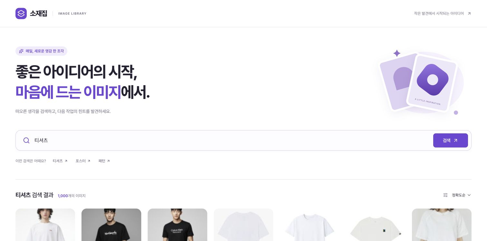
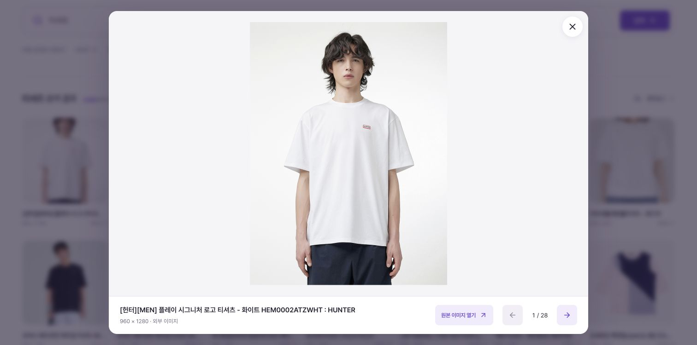
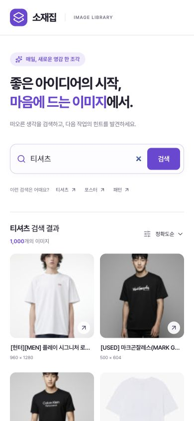
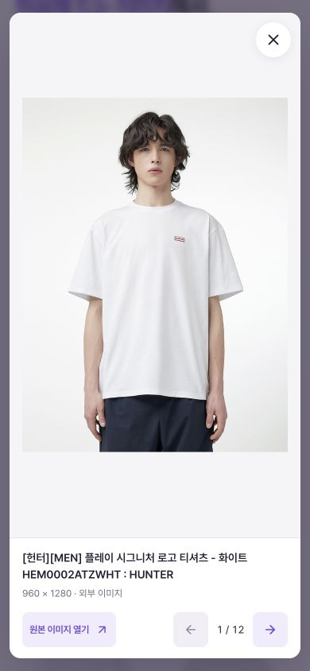

# 소재집

**네이버 이미지 검색 결과를 화면 크기에 맞춰 탐색하는 이미지 검색 사이트입니다.**

검색어를 입력해 이미지를 찾고, 정확도순·최신순으로 정렬하거나 미리보기에서 원본을 확인할 수 있습니다. 화면 너비에 따라 한 페이지의 이미지 수를 바꾸고, 보던 이미지가 포함된 페이지로 이동합니다.

[사이트 바로가기](https://imageapi-test.vercel.app)

[주요 기능](#주요-기능) · [기술 스택](#기술-스택) · [실행 방법](#실행-방법)



배포 사이트에서 네이버 이미지 검색 결과를 촬영했습니다. 검색 시점에 따라 결과가 달라질 수 있습니다.

## 주요 기능

| 기능           | 동작                                                                        |
| -------------- | --------------------------------------------------------------------------- |
| 이미지 검색    | 검색어 입력, 정확도순·최신순 정렬, 페이지 이동                              |
| 미리보기       | 이미지 확대, 원본 링크, 좌우 방향키 탐색, Escape 닫기                       |
| 검색 조건 공유 | 검색어·정렬·페이지를 URL에 저장하고 새로고침·뒤로가기 시 복원               |
| 반응형 목록    | 화면 너비에 따라 12·20·28·40개를 요청하고 현재 탐색 위치에 맞춰 페이지 보정 |
| 오류 복구      | 일시적인 오류 재시도, 기존 결과 유지, 호출 제한 시 대기 시간 안내           |

<details>
<summary>미리보기와 모바일 화면 보기</summary>

### 이미지 미리보기



### 모바일




</details>

## 기술 스택

| 구분                | 사용 기술                                                |
| ------------------- | -------------------------------------------------------- |
| 화면·서버           | Next.js App Router, React, TypeScript                    |
| 스타일·UI           | Tailwind CSS, Radix Dialog, Pretendard                   |
| 검색 데이터         | TanStack Query, Zod / Zod Mini                           |
| 공유 캐시·호출 제한 | Upstash Redis REST API — 연결 시 사용                    |
| 테스트·CI           | Vitest, Testing Library, Playwright, axe, GitHub Actions |

## 실행 방법

설치 없이 사용하려면 [배포 사이트](https://imageapi-test.vercel.app)에 접속하면 됩니다.

아래는 코드를 내려받아 내 컴퓨터에서 실행하는 방법입니다. 개발 환경은 Node.js 24입니다.

```bash
# 프로젝트에서 사용하는 패키지 설치
npm ci

# 로컬 설정 파일 생성
cp .env.example .env.local

# 개발 서버 실행
npm run dev
```

브라우저에서 `http://localhost:3000`에 접속합니다. 기본 설정에서는 네이버 검색 대신 프로젝트에 포함된 샘플 이미지를 보여줍니다. `티셔츠`, `포스터`, `패턴`으로 검색과 페이지 이동을 확인할 수 있습니다.

<details>
<summary>내 컴퓨터에서도 실제 네이버 검색을 사용하려면</summary>

네이버 검색 API를 사용할 수 있는 Client ID와 Client Secret을 발급받아 `.env.local`에 입력합니다.

```dotenv
SEARCH_MODE=live
NAVER_CLIENT_ID=발급받은_ID
NAVER_CLIENT_SECRET=발급받은_SECRET
```

실행 중인 서버를 종료하고 `npm run dev`로 다시 시작하면 실제 검색 결과가 표시됩니다. 발급받은 키가 들어 있는 `.env.local`은 Git에 올리지 않습니다.

Redis는 같은 검색 결과를 재사용하고 앱 전체의 API 호출 수를 제한하기 위한 선택 설정입니다. 연결 방법에 필요한 환경 변수는 [`.env.example`](./.env.example)에 있습니다.

</details>

## 테스트

```bash
npm run check
npx playwright install chromium firefox webkit
npm run test:e2e
```

`check`는 포맷·린트·타입 검사, 단위 테스트, 빌드를 실행합니다. E2E는 production 서버에서 Chromium·Firefox·WebKit으로 검색·반응형·키보드 동작을 검사합니다.
